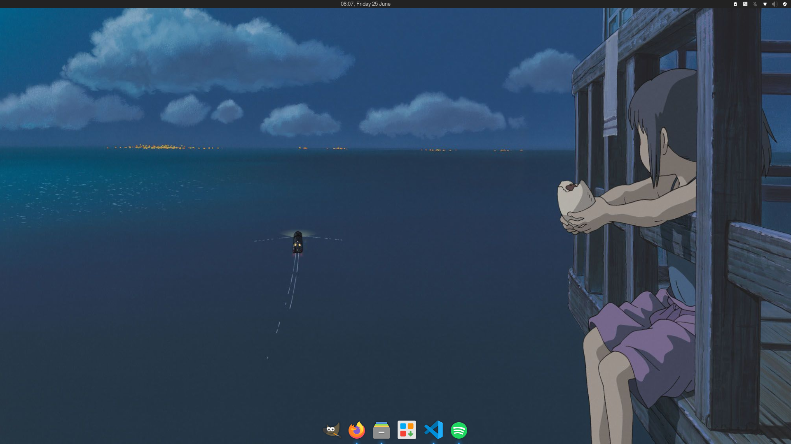

# Openbox/Arch config files
My config files for an arch linux installation using openbox WM. Mostly meant as a guide to myself so that I can later rebuild the same config if necessary. Includes a list of all the main programs used to set up the build.

## Demo
Image of build in progress. Might update with more images later as I make more progress.


## Programs

### Display server
Uses X11 as the display server. Install _xorg_ and appropriate video driver.
```
sudo pacman -S xorg xorg-xinit nvidia nvidia-utils
```

### Desktop Environment/Window manager
Using _openbox_ window manager. Install openbox and some configuration programs
```
sudo pacman -S openbox obconf
```
Have to run openbox from _.xinitrc_ to run every time as soon as the sessioon starts.

### Display manager
Uses _lightdm_ to manage sessions,login and lockscreen and stuff. Uses _lightdm-gtk-greeter_ for the login and lockscreen greeter. Install the service,greeter and a program for customizing the greeter
```
sudo pacman -S lightdm lightdm-gtk-greeter lightdm-gtk-greeter-settings
```
the lightdm service has to be enabled in systemd
```
systemctl enable lightdm
```
### Basic desktop
#### Wallpaper
_nitrogen_ was used to set the wallpaper. The app runs on startup every time to restore the last set wallpaper. 
#### Dock
The _plank_ dock was used as the dock. 
#### Panel
The _Tint2_ panel was used to get a panel. The panel was configured to work as a top panel with a basic [custom tint2 configuration](tint2/)